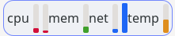
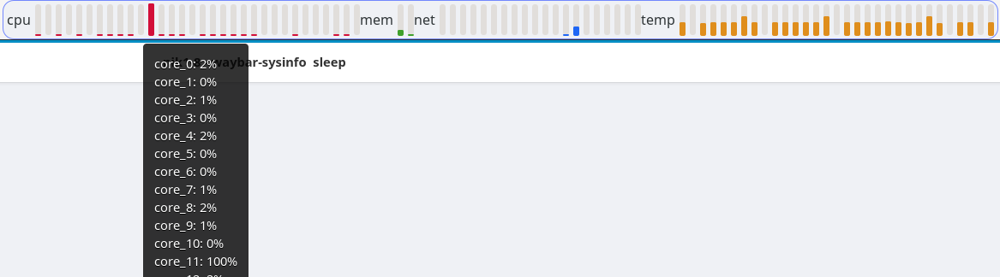

# Waybar sysinfo plugin
This is a plugin for waybar that displays system information as vertical bars. Inspired by xfce-systemload plugin

This plugin can display following information:
* cpu load, including average load, most loaded core and all cores
* used memory and swap
* network activity
* temperature - max of chosen sensors or all

With reasonable settings



With unreasonable settings



## Installation
For now only manual installation
```
cargo build --release
cp target/release/libwaybar_sysinfo.so ~/.local/lib/
```

## Config
```jsonc
"modules-right": [
    "cffi/sysinfo",
]
"cffi/sysinfo": {
    "module_path": "/home/USER/.local/lib/libwaybar_sysinfo.so",
    // refresh interval in milliseconds
    "interval_ms": 5000,
    "cpu": {
        "label": "cpu", // "cpu" is default; you could change this to an icon
        // show most loaded core, avg of all cores or all cores
        "show": ["max_core", "avg_core", "all_cores"]
    },
    "mem": {
        "label": "ram", // "ram" is default
        "show": ["mem", "swap"]
    },
    "net": {
        "label": "net", // "net" is default
        // show all networks that match this regexes
        "show": ["eno\\d+", "wlan\\d+"]
    },
    "temp": {
        "label": "temp", // "temp" is default
        // show sensor with this name. you can see the list by running `sensors`
        "show": ["Core 1"]
        // show max value for each regex
        "show_max": ["Core .*"]
    },
},
```

## Style
This is the default config

```css
.sysinfo-bar {
    padding-left: 5px;
    padding-top: 5px;
    padding-bottom: 5px;
}

/* progress bar */
trough {
    min-height: 3px;
    min-width: 7px;
    border: none;
}

/* colored part of progress bar */
progress {
    border: none;
    min-width: 7px;
}

.cpu progress {
  background-color: #d20f39;
}

.mem progress {
  background-color: #40a02b;
}

.net progress {
  background-color: #1e66f5;
}

.temp progress {
  background-color: #df8e1d;
}
```

Other useful information and examples for styling:

```css
/**
 * The whole module is selectable with `.sysinfo`
 */
.sysinfo {
  background-color: green;
}

/**
 * The separate widgets are selectable by their label
 * (beware that this changes if the label is set to a custom value)
 */
.sysinfo-module.mem, .sysinfo-module.my-custom-network-label {
  margin-left: 10px;
}
```
