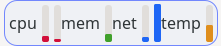
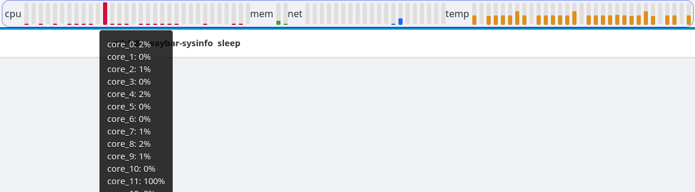

# Waybar sysinfo plugin
This is a plugin for waybar that displays system information as vertical bars. Inspired by xfce-systemload plugin

This plugin can display following information:
* cpu load, including average load, most loaded core and all cores
* used memory and swap
* network activity
* temperature - max of chosen sensors or all

With reasonable settings



With unreasonable settings



## Installation
For now only manual installation
```
cargo build --release
cp target/release/libwaybar_sysinfo.so ~/.local/lib/
```

## Config

1.  Add the module (identified by `cffi/sysinfo`) to your bar as you would with any other module.

    For example:

    ```jsonc
    "modules-right": [
        "cffi/sysinfo",
    ],
    ```

2.  Add your configuration for the module (again identified by `cffi/sysinfo`),
    with options described in the table below.

    Almost-minimal example:

    ```jsonc
    "cffi/sysinfo": {
        "module_path": "/home/YOUR-USER/.local/lib/libwaybar_sysinfo.so",
        "cpu": {
            "show": ["avg_core"],
        },
        "mem": {
            "show": ["mem"]
        },
    },
    ```

### Configuration options

| Field            | Type    | Default      | Description |
| ---------------- | ------- | ------------ | ----------- |
| `module_path`    | string  | none; **required** | Path to the `libwaybar_sysinfo.so` module (absolute, or relative to waybar's CWD) |
| `interval_ms`    | integer | `5000`       | Refresh interval in milliseconds |
| `cpu`            | object  | absent       | Configuration for CPU monitor; leave absent for none |
| `cpu.label`      | string  | `cpu`        | Label for CPU monitor; it could be an icon if you have Nerdfonts or similar |
| `cpu.show`       | array with allowed values `max_core`, `avg_core`, `all_cores` | none; **required** | Specific CPU monitors to show; `max_core`: most loaded core; `avg_core`: average load of all cores; `all_cores`: separate bars for each core |
| `mem`            | object  | absent       | Configuration for memory monitor; leave absent for none |
| `mem.label`      | string  | `mem`        | Label for memory monitor; it could be an icon if you have Nerdfonts or similar |
| `mem.show`       | array with allowed values `mem`, `swap` | none; **required** | Specific memory monitors to show; `mem`: used memory; `swap`: used swap |
| `net`            | object  | absent       | Configuration for network monitor; leave absent for none |
| `net.label`      | string  | `net`        | Label for network monitor; it could be an icon if you have Nerdfonts or similar |
| `net.show`       | array of regex strings | none; **required** | Network interfaces to monitor, as regexes (which are not implicitly anchored) |
| `net.floor`      | integer | `2097152`    | Minimum value to use for the maximum throughput rate, in bytes per second; automatically increased where necessary within a sliding window |
| `net.scaling`    | object  | `{ "type": "log_power", "exponent": 4 }` | Scale mapping to use for network throughput |
| `net.scaling.type` | string with allowed values `linear`, `power`, `log_power` | none; **required** | Type of scaling to use; `linear`: linear relationship (`rate/max`); `power`: exponential relationship (`(rate/max)^exponent`); `log_power`: logarithmic relationship (`(log(rate+1)/log(max+1))^exponent`) |
| `net.scaling.exponent` | float | unsupported for `linear`, **required** for `power` and `log_power` | Exponent to use for `power` or `log_power` scaling; for `power` an exponent of 1 would be the same as `linear`, and the closer to zero, the more small throughput is visually boosted (try 0.33); for `log_power` pick numbers greater than zero, with larger numbers boosting small throughputs less (try 4) |
| `temp`           | object  | absent       | Configuration for temperature monitor; leave absent for none |
| `temp.label`     | string  | `temp`       | Label for temperature monitor; it could be an icon if you have Nerdfonts of similar |
| `temp.show`      | array of strings | empty | Temperature sensors to show by exact name (find with `sensors`) |
| `temp.show_max`  | array of regex strings | empty | Sets of sensor names matched by regex to aggregate into single bars showing the maximum of each set |

### Configuration example

Note that defaults are above.
Nothing in the following configuration is default,
in order to highlight some reasonable non-default settings.

```jsonc
"cffi/sysinfo": {
    "module_path": "/home/USER/.local/lib/libwaybar_sysinfo.so",
    "interval_ms": 2000,
    "cpu": {
        "label": "\uf4bc", // same as literal ""
        "show": ["max_core", "avg_core"],
    },
    "mem": {
        "label": "\uefc5", // same as literal ""
        "show": ["mem", "swap"],
    },
    "net": {
        "label": "\udb81\udef3", // same as literal "󰛳"
        "show": ["^eno\\d+$", "^wlan\\d+$"], // naming conventions vary by distro; other examples: "^en", "^wl"; "." or empty string to match all
        "floor": 12500000, // a full 100mbit pipe
        "scaling": {
            "type": "power",
            "exponent": 0.33,
        },
    },
    "temp": {
        "label": "\uf2c7", // same as literal ""
        "show_max": ["^Core \\d+$"], // show one bar for the highest out of all "Core n" sensors
    },
},
```

## Style
This is the default config

```css
#sysinfo .sysinfo-bar {
    padding-left: 5px;
    padding-top: 5px;
    padding-bottom: 5px;
}

/* progress bar */
#sysinfo trough {
    min-height: 3px;
    min-width: 7px;
    border: none;
}

/* colored part of progress bar */
#sysinfo progress {
    border: none;
    min-width: 7px;
}

#sysinfo .cpu progress {
  background-color: #d20f39;
}

#sysinfo .mem progress {
  background-color: #40a02b;
}

#sysinfo .net progress {
  background-color: #1e66f5;
}

#sysinfo .temp progress {
  background-color: #df8e1d;
}
```

Other useful information and examples for styling:

```css
/**
 * The whole module is selectable with `#sysinfo`
 */
#sysinfo {
  background-color: green;
}

/**
 * The separate widgets are selectable with `.sysinfo-module`
 */
#sysinfo .sysinfo-module + .sysinfo-module {
  margin-left: 10px;
}

/**
 * The separate widgets also have a class for their type
 */
#sysinfo .sysinfo-module.cpu progress {
  background-color: blue;
}

/**
 * The separate widgets also have a class for their custom label
 */
#sysinfo .sysinfo-module.my-label progress { ... }

/**
 * Bars are given classes `gte-10`...`gte-90` for how full they are,
 * allowing colors or other styling to change accordingly
 */
#sysinfo .sysinfo-bar.gte-70 progress { background-color: yellow; }
#sysinfo .sysinfo-bar.gte-80 progress { background-color: orange; }
#sysinfo .sysinfo-bar.gte-90 progress { background-color: red; }

/**
 * Bars might be rounded by default; radius can be adjusted,
 * separately for `trough` and `progress`
 */
#sysinfo trough, #sysinfo progress {
  border-radius: 0px; /* for no rounding */
  border-radius: 2px; /* for a fixed radius */
  border-radius: 1000px; /* or some other high number for as close to circular as possible */

  /* Or you can control the different corners separately */
  border-top-radius: 1000px 1000px 0px 0px; /* for curved tops and flat bottoms */
}
```
